## Введение
Исследование посвящено выявлению различий между политическим дискурсом республиканцев и демократов в США на материале новостных изданий Breitbart (республиканское) и Mother Jones, Common Dreams (демократические) за период с 1 мая по 19 июня 2025 года. Размер корпуса новостей республиканского крыла: 471_359 слов; демократического - 713_822 слов. 

Корпус был собран с использованием библиотек requests и BeautifulSoup. В исследовании были использованы методы skipgrams, анализ тональности и тематическое моделирование. 

## Skipgrams

### Target 'america'
__Все коллокаты:__
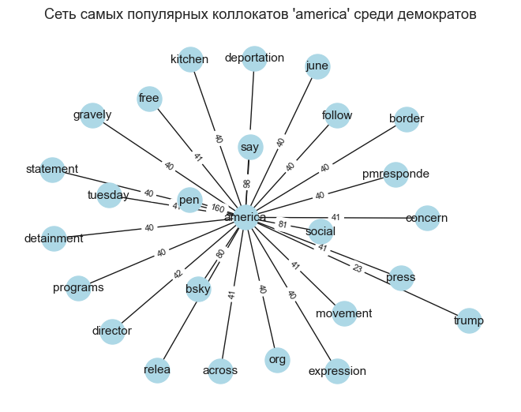
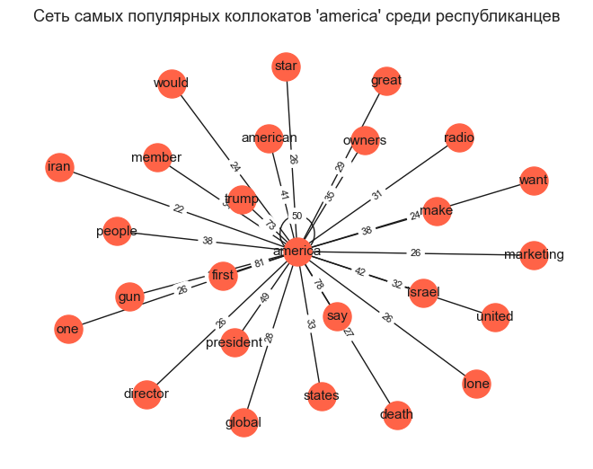

На основании сетей коллокатов слова 'america' в либеральных и консервативных корпусах можно сделать следующие наблюдения:

__1. Существительные и имена собственные:__
У республиканцев рядом со словом _america_ преобладают такие слова, как _trump, president, states, gun, war, country, israel,_ что отражает фокус на внешней политике и национальной безопасности. У демократов, напротив, коллокации с _america_ включают _programs, deportation, expression, border, movement, detainment_,то есть они сфокусированы на социальных вопросах, на внутренней политике. 
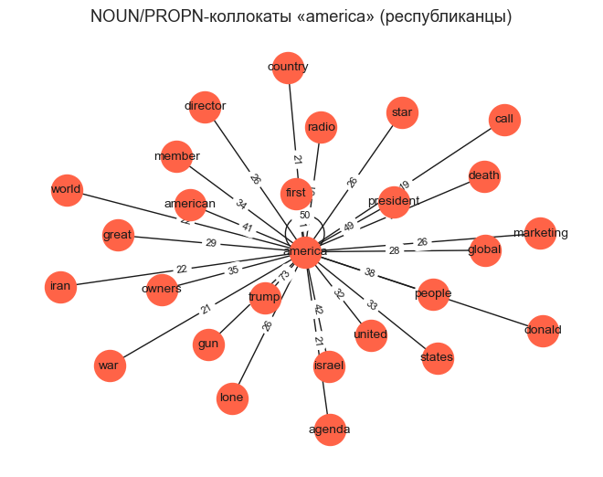
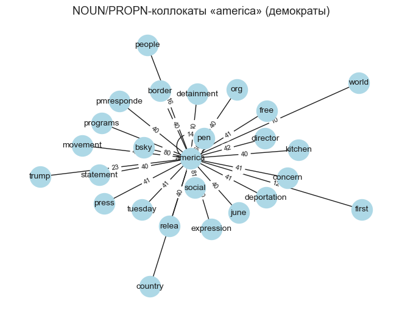

__2. Прилагательные:__
Обе группы используют близкий набор описательных слов: _good, bad, great, true, critical, secure, poor, dead, domestic, conservative._
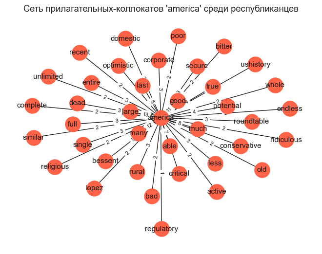
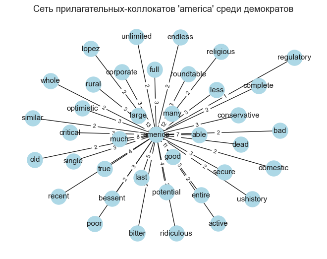

### Target 'democracy'
__Все коллокаты:__
На графиках представлены наиболее частотные слова, встречающиеся рядом с _democracy_ в речах республиканцев и демократов. Сети в целом похожи: в обоих случаях фиксируются связи с _freedom, people, rule, american, defend, undermine, american_ и другими политическими терминами. 
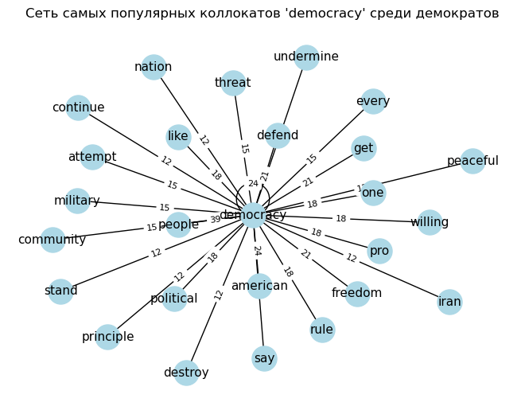
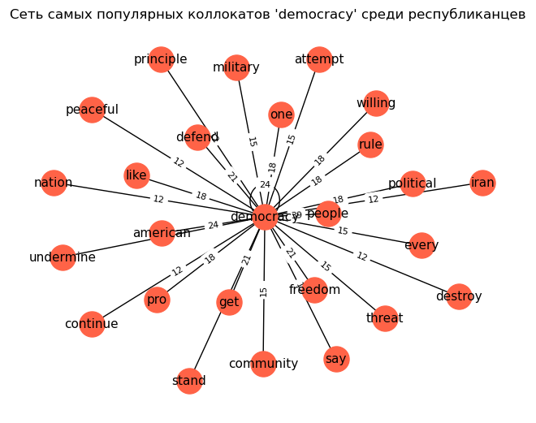

__1. Существительные и имена собственные:__
Графы почти идентичны по структуре, содержанию узлов и частотным характеристикам, что говорит о схожем понятийном контексте слова _democracy_ у обеих сторон.
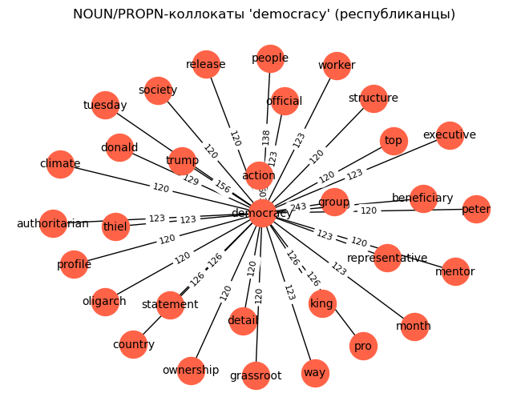
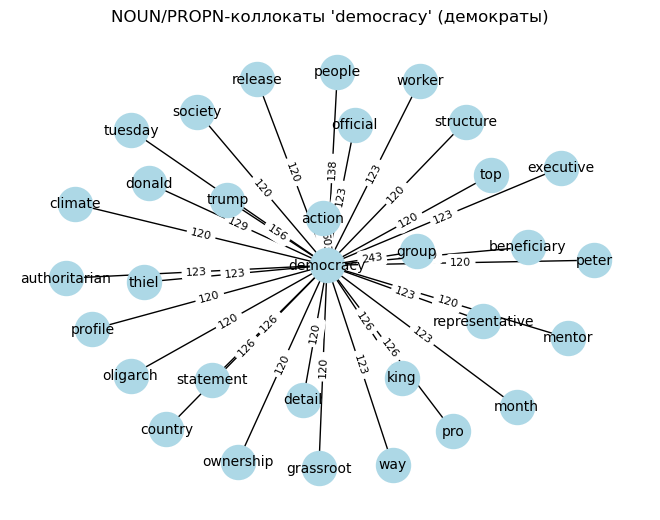

__2. Прилагательные:__
Обе партии используют схожие прилагательные — _political, free, military, undemocratic, peaceful, authoritarian, unpatriotic, willing, principle,_ что указывает на наличие устойчивого контекста, в котором рассматривается концепт демократии в обеих партиях. 
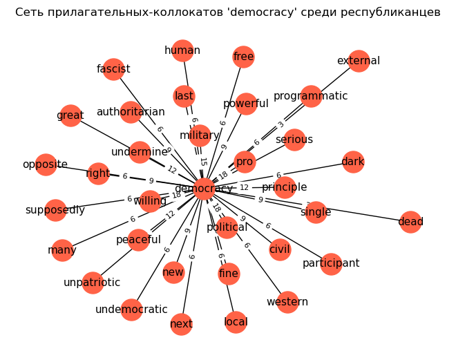
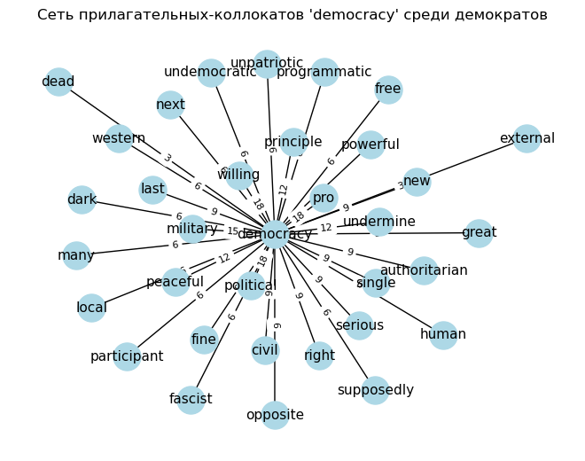

__3. Глаголы:__
Наборы глаголов также почти не различаются. Обе группы сочетают _democracy_ с глаголами _defend, get, say, destroy, believe, warn, make, stand, promote, unite, save, resist_ и др. 
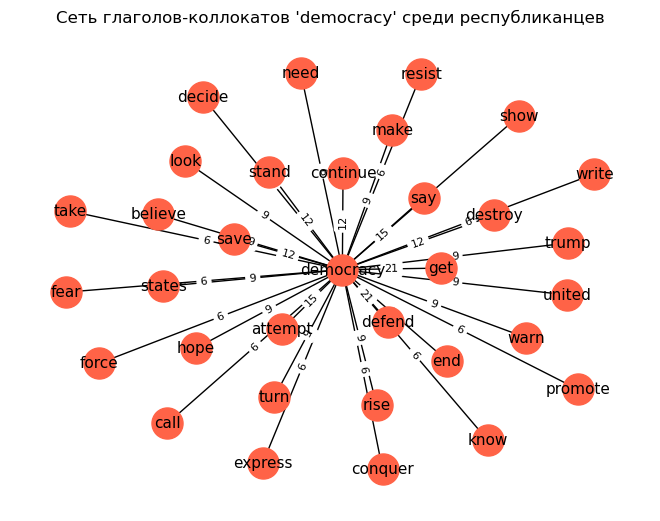
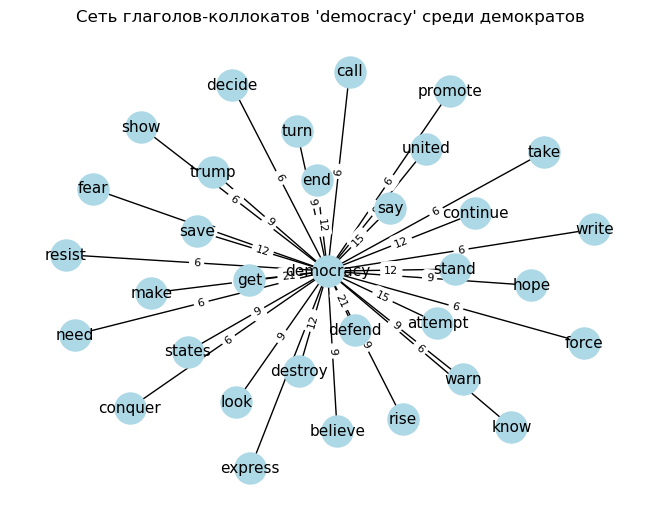

### Target 'migrant'
__Все коллокаты:__
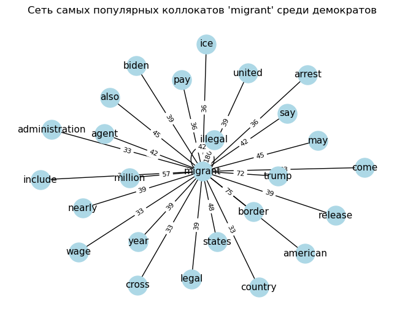
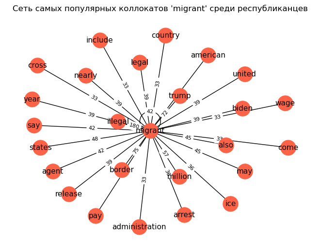

__1. Существительные и имена собственные:__
Анализ графов демонстрирует высокий уровень совпадения по ключевым существительным: в обоих корпусах выделяются такие слова, как _child, country, deportation, government, administration, flight, refugee_ и _detention_. Это может свидетельствовать о схожих тематических полях.

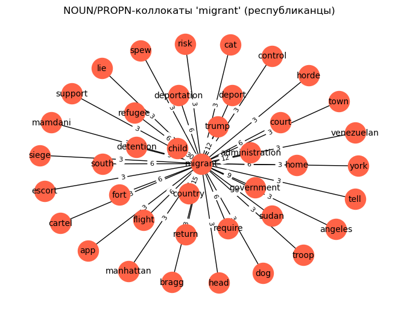
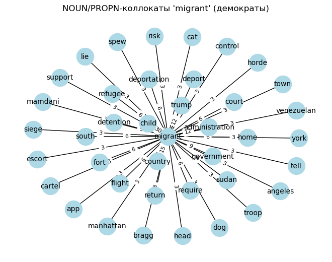

__2. Прилагательные:__
Для обеих групп характерны слова с правовым и административным контекстом, такие как _illegal, legal, deportation, border, states, asylum, release. 
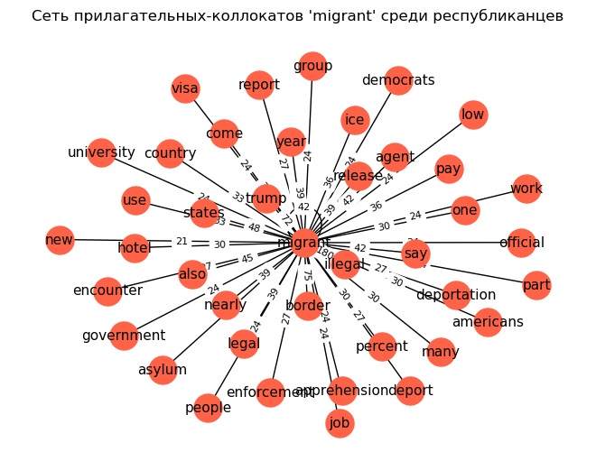
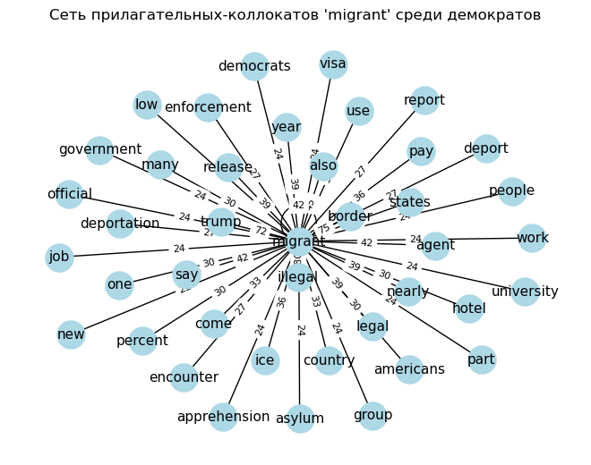

__3. Глаголы:__
В обеих группах используются глаголы, связанные с миграцией: _release, say, come, cross, include, get, make, pay, end, use, encounter_ и др.
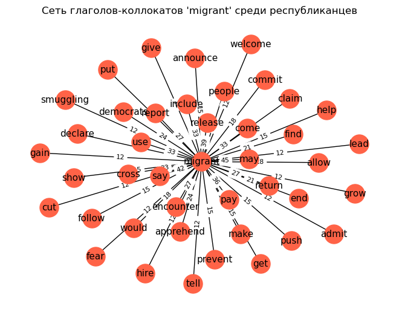
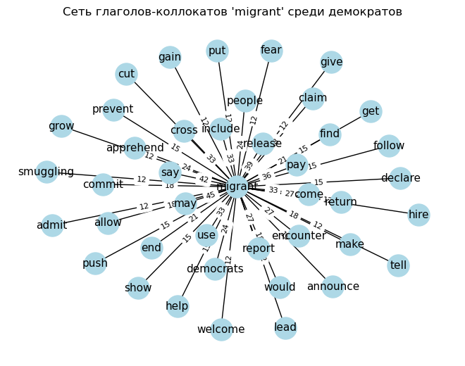

__Вывод:__

Результаты анализа демонстрируют, что лексическое окружение ключевых слов _america, democracy_ и _migrant_ во многом схоже в республиканских и демократических новостных источниках. Это может быть связано с актуальной политической повесткой, которая освещается как в демократических, так и в республиканских изданиях. Тем не менее, различия в акцентах — например, фокус на внешнюю, либо внутреннюю политику — указывают на некоторые идеологические особенности партий. 

## Ближайшие соседи 
Сравнение 10 ближайших соседей по отобранным нами ключевым словам в республиканской и демократической Word2Vec-моделях выявляет заметные идеологические различия в контекстах употребления. Слово _freedom_ в демократической модели ассоциируется понятиями _holiday, jurisdiction, presence_, в то время как в консервативной — с _terrorism, opposition, determine_. Вокруг слова _government_ у либералов встречаются _efficiency, oligarchy, truth_, тогда как у республиканцев — более прагматичные _power, keep, put_. Вокруг _immigration_ у обеих сторон фигурируют органы принуждения (_customs, enforcement, ICE_), но у либералов больше фокуса на гуманитарных аспектах (_bed, provider_), а у республиканцев — на карательных действиях (_arrest, raid_). Темы _climate_ и _abortion_ также демонстрируют характерные различия: либеральная модель связывает climate с _disaster, impact, environmental_, а консервативная — с _strategy, corrupt_. В случае _abortion_, у либералов доминирует медицинский и правозащитный контекст (_trimester, pill, safe_), тогда как у республиканцев — социально-образовательный (_gender, school, liberty_). Эти различия подтверждают, что даже в распределённом векторном пространстве политическая поляризация чётко отражается в лексических ассоциациях.

| word        | top-10 у демократов                                                                                         | top-10 у республиканцев                                                                                      |
|-------------|----------------------------------------------------------------------------------------------------|-------------------------------------------------------------------------------------------------|
| freedom     | holiday, warning, jurisdiction, disturbing, presence, noncitizen, destination, whose, regard, pull | exactly, fully, hide, terrorism, die, example, determine, opposition, previous, nothing         |
| government  | efficiency, overthrow, oligarchy, presidency, function, loot, truth, board, sycamore, pocket       | case, put, work, power, clear, back, keep, around, seek, number                                 |
| immigration | enforcement, jersey, customs, lockup, crackdown, bed, provider, transfer, prisoner, admit          | customs, agent, federal, arrest, officer, law, assault, enforcement, raid, ice                  |
| security    | undermine, beyond, denounce, retirement, preserve, expansion, reference, modest, outlook, homeland | administration, area, homeland, states, involve, attempt, charge, stop, county, block           |
| tax         | cuts, jobs, ricks, trillion, saving, satellite, payroll, deprive, cap, adjust                      | vote, deficit, price, spending, trillion, pass, inflation, billion, tariff, might               |
| climate     | disaster, environmental, impact, structure, ownership, objection, subsidy, pretext, breed, study   | corrupt, strategic, initiative, distribute, whole, particularly, oak, strategy, mineral, detail |
| abortion    | trimester, volunteer, charge, result, course, record, field, handcuff, pill, safe                  | recent, clinic, gender, next, likely, school, education, less, index, liberty                   |
| border      | agent, fit, interrogate, writing, pen, org, visitor, relea, alistair, screen                       | carry, deportation, operation, deport, serve, operations, patrol, migrant, fine, allegedly      |
| crime       | prisoner, admit, son, lockup, monster, sad, piece, commit, parade, abortion                        | murder, court, rapist, boat, prevent, identity, expand, previous, gang, rape                    |
| election    | win, memorial, holocaust, language, dehumanizing, anguish, quite, mean, next, frustration          | quiz, primary, next, ceo, prageru, additional, vaccine, censorship, band, memorial              |

# TSNE и K-Means кластеризация
Кластеризация республиканского корпуса выявила несколько плотных и интерпретируемых смысловых зон.
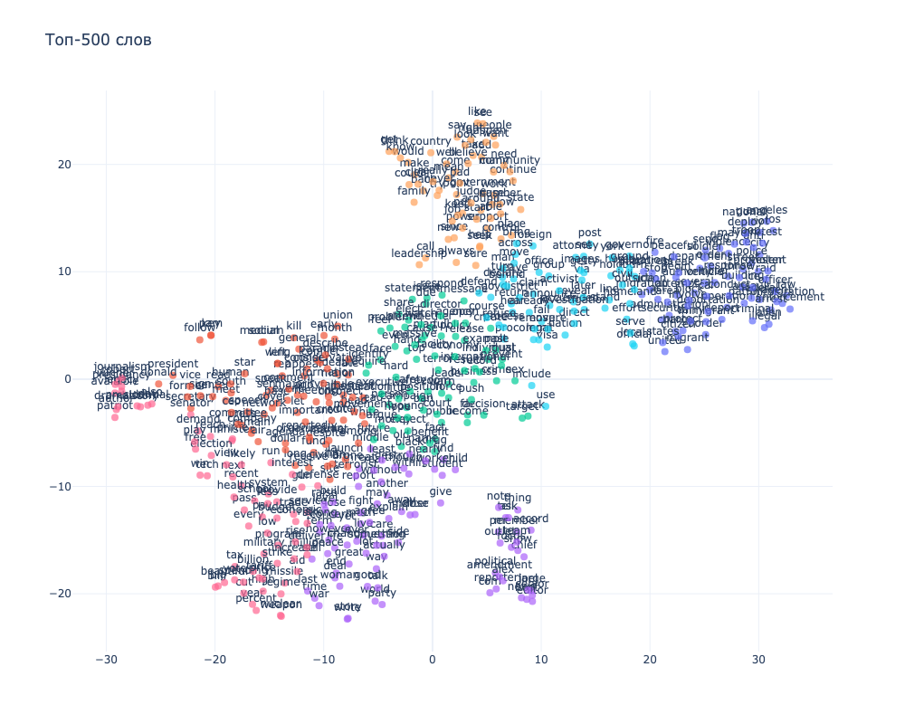

На этом участке графика наблюдается отчетливо сформированный кластер, посвящённый тематике иммиграции, правопорядка и силового контроля. В центре внимания — лексика, связанная с депортацией, нелегальной миграцией и иммиграционным агентством ICE: _deportation, immigrant, border, ice, deport, arrest, agent, enforcement, illegal, alien_. Это однозначно отсылает к дискурсу Дональда Трампа и республиканской риторике, акцентирующей внимание на ужесточении миграционной политики и укреплении южной границы. Рядом расположены слова, связанные с протестами и силовым вмешательством: _protester, riot, violent, police, raid, troop, national, guard, order, mayor, building, street_. 
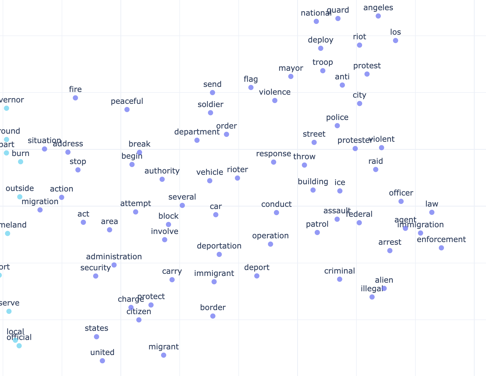

На этой части графика располагаются лексемы, связанные с военной тематикой: _gun, drone, military, weapon, missile, terrorist, war, defense_. Несмотря на очевидную семантическую близость, они попадают в разные кластеры — это свидетельствует о некоторой несогласованности распределений в векторном пространстве. 
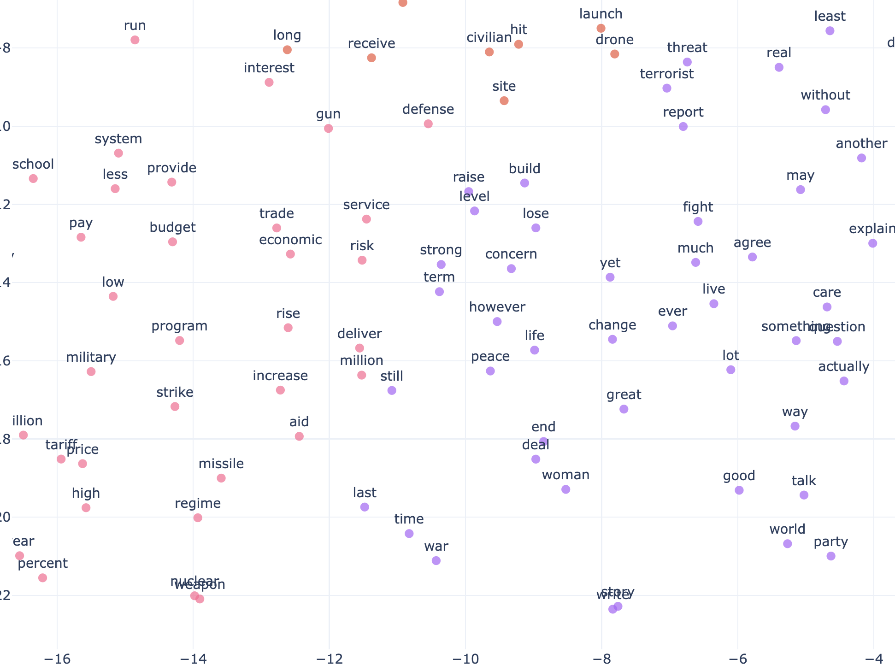

В случае демократов кластеры оказываются менее четко выраженными и более расплывчатыми по тематике. 
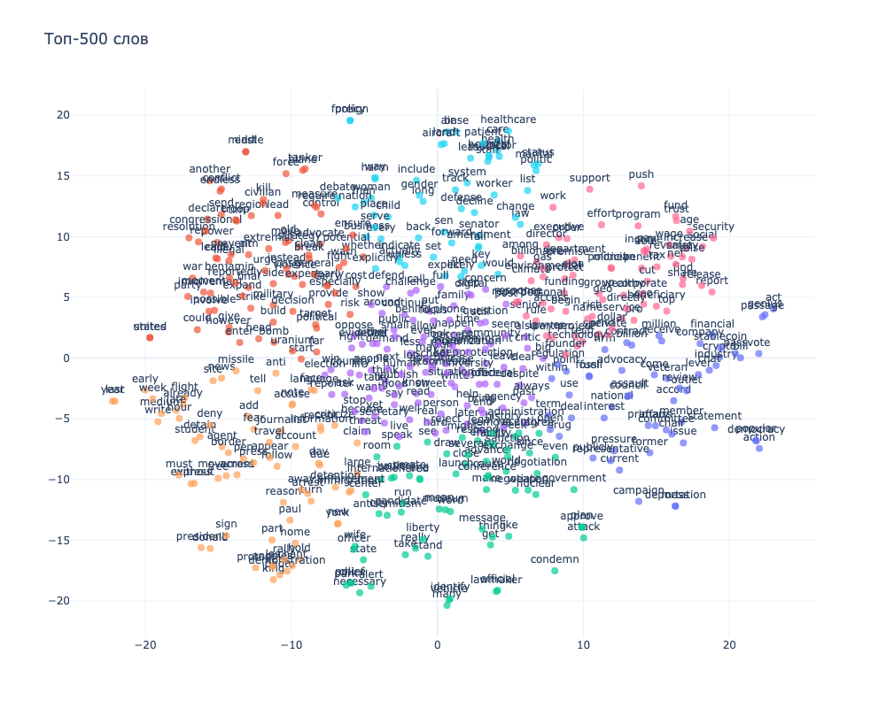

Этот кластер связан с вопросами границ, миграции и свободы слова. В центре - слова _border, agent, press, journalist, protest, student, arrest, detention, demonstration_ - формирующие социально-политическую повестку, связанную с правами мигрантов, задержаниями, уличными протестами. Попадание в кластер таких слов, как _journalist, press, account, accuse_ и _criticize_ также подчеркивает фокус на свободе информации и возможных конфликтах между медиа и силовыми структурами. 
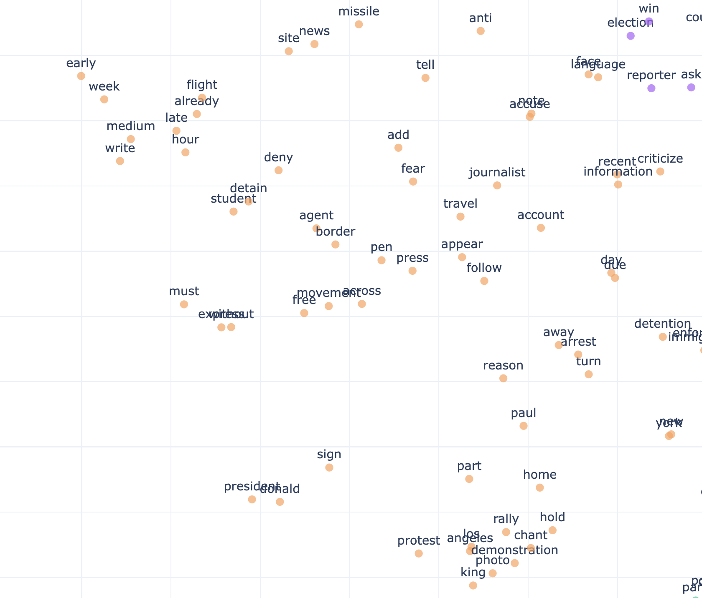

На следующей части графика выделяется группа слов, отражающих темы, связанные с системой здравоохранения, социальной защитой и законодательными инициативами: _healthcare, hospital, medical, doctor, patient, staff_. Также наблюдаются слова, связанные с законодательной и социальной структурой: _senator, amendment, law, change, status, marital, politic_ Наличие слов вроде _gender, decline, system, need, worker_ и _care_ подчеркивает обеспокоенность социальной справедливостью, неравенством и необходимыми реформами. 
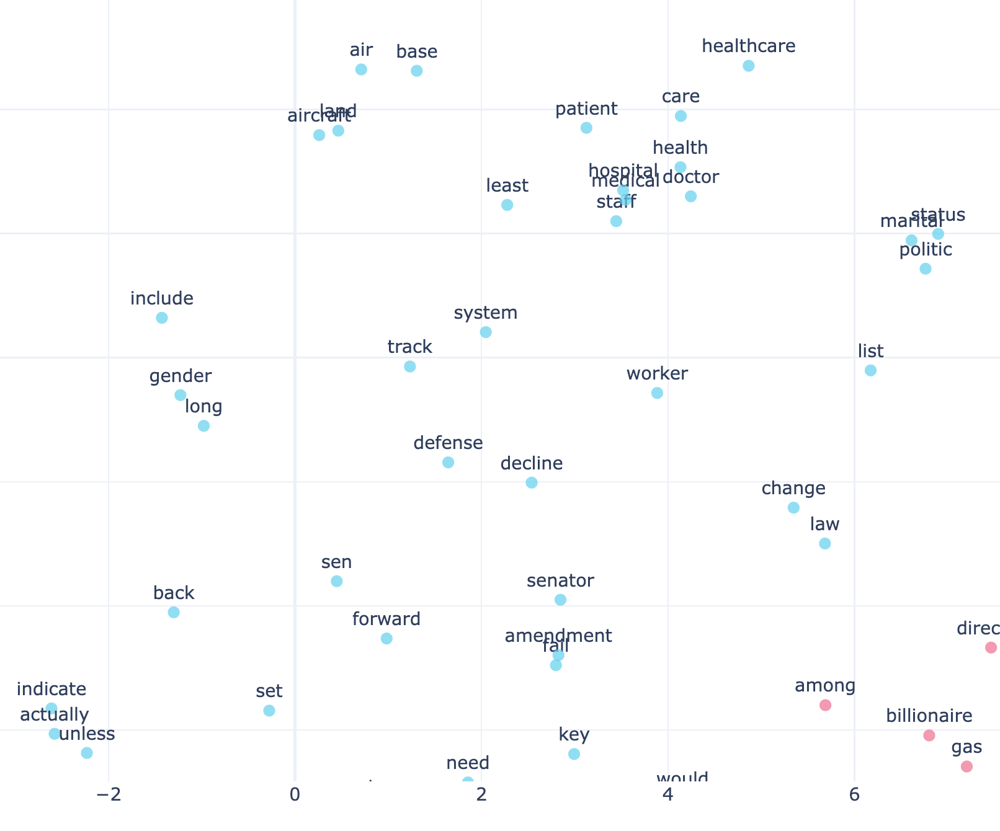

__Вывод:__
Кластеризация показала, что в республиканском корпусе слова группируются в чёткие и понятные темы. Например, есть отдельный кластер про иммиграцию и силовые структуры (ICE, депортации, протесты), а также кластер про армию и оружие. Это говорит о том, что республиканская риторика сосредоточена на безопасности, порядке и военных вопросах.

У демократов темы более смешанные, но тоже есть определённые группы. Одна из них связана с миграцией, протестами и свободой слова, другая — с медициной, социальной защитой и законами. Это показывает, что демократы чаще поднимают социальные и гуманитарные вопросы.

Таким образом, t-SNE и K-Means подтвердили различие в тематических фокусах и риторических стратегиях двух политических лагерей.

## Анализ тональности
Анализ распределения эмоционально окрашенных слов на основе трех методов: 

### 1. VADER

VADER - это инструмент анализа тональности, хорошо работающий с неформальными текстами. Он использует лексикон эмоционально значимых слов. 
Демократы в среднем высказываются немного позитивнее (mean = +0.04), но в целом новостной дискурс характеризуется нейтральной тональностью. 
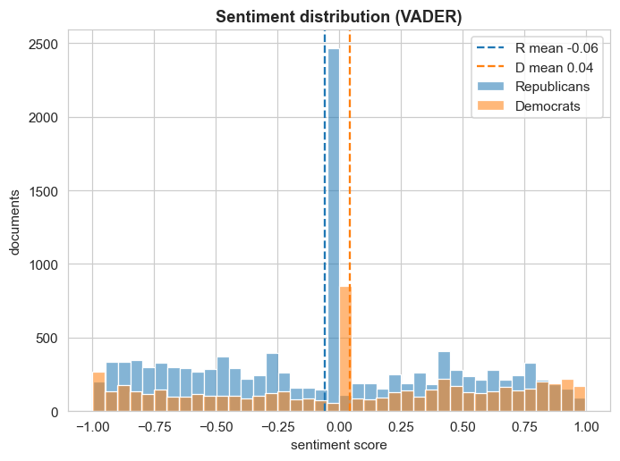

### 2. TextBlob

Демократы вновь демонстрируют более позитивный тон (mean = +0.06), но различия менее выражены. 
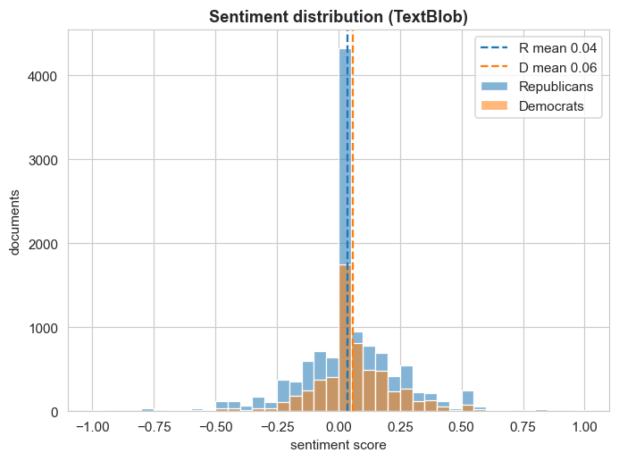

### 3. RoBERTa

Эта модель обучена на ~124M твитах с января 2018 по декабрь 2021 г. Мы выбрали именно эту модель, поскольку анализируем политические новости, а именно в твиттере часто обсуждается американская политика. В этой нейросетевой модели обе группы получают отрицательные оценки, но демократы высказываются еще более негативно, чем республиканцы (−0.26 против −0.22). Это может быть связано с тем, что RoBERTa обучалась на твиттер-данных, где негативный язык используется иначе, и частая критика власти у демократов могла быть интерпретирована как негатив.
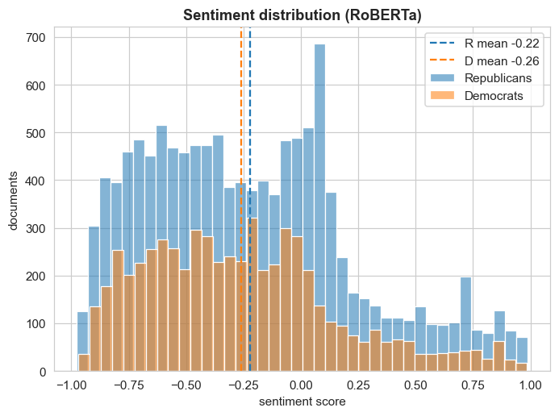

__Вывод:__

Разные модели по-разному интерпретируют тональность политических текстов. VADER и TextBlob фиксируют более позитивную интонацию у демократов, в то время как RoBERTa приписывает обоим лагерям преимущественно негативный тон, с чуть большим смещением у демократов.

## Тематический анализ

В данном исследовании мы сознательно не удаляли именованные сущности из корпуса, поскольку в политическом дискурсе они играют существенную роль. Упоминания персоналий, стран, организаций и ключевых событий нередко являются тематически значимыми элементами. С учётом этого, для предобработки мы ограничились удалением стандартных стоп-слов.

Сначала мы подобрали оптимальное количество тем на основе показателей perplexity и coherence
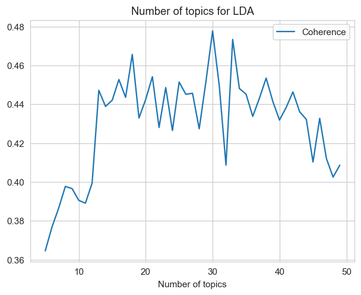
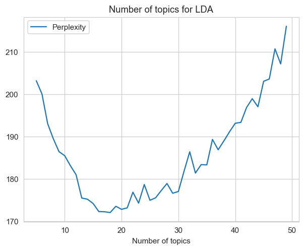

Выбрали 18 топиков - с этим значением модель демонстрирует лучшую когерентность и самую низкую перплексию. 

На графиках представлено среднее распределение тем в корпусах демократических и республиканских новостей. 
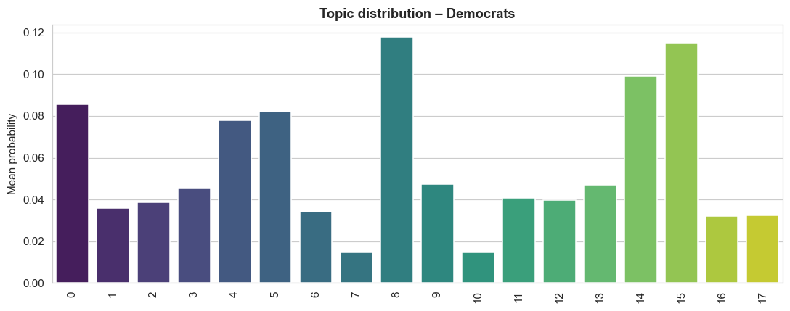
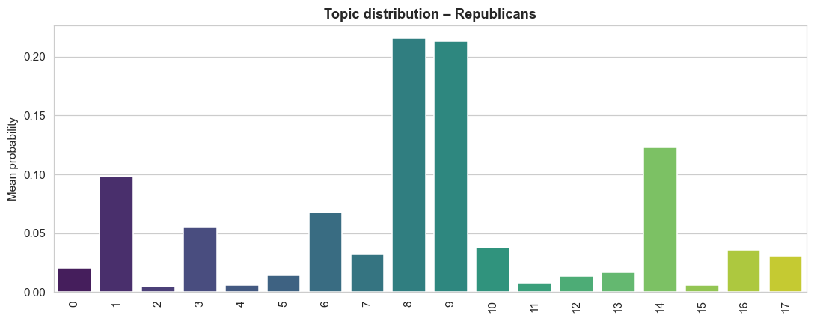

У демократических изданий доминируют темы 8, 14 и 15, каждая из которых встречается в среднем более чем в 10% текстов. У республиканцев особенно выделяются темы 8 и 9, которые явно преобладают — каждая из них составляет около 20% всех текстов. 

### Какие темы чаще встречаются у республиканцев, а какие — у демократов?

На графике представлено нормированное сравнение тематических распределений между республиканскими и демократическими источниками. По оси X - значения χ-score (разность средних значений вероятности темы между группами, нормированная на объединённую дисперсию).
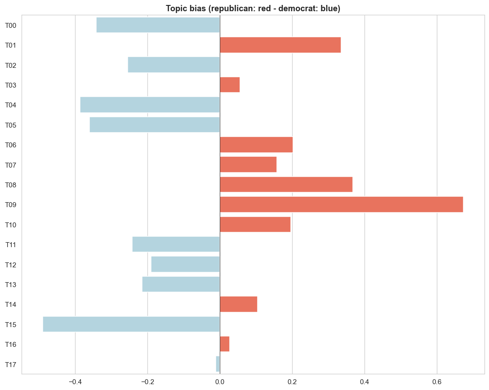

### Самые демократические темы:

- __Тема 00 — «Война, сенат, криптовалюта»__

Ключевые слова: _bill, war, senate, president, trump, crypto, congress, republican, stablecoin, democrats, democratic_ 

Эта тема отражает законодательную повестку и обсуждение ключевых политических решений: законы, резолюции, финансирование. Важны внешнеполитические аспекты (_iran, war, israel_) и внутренняя политика (_congress, bill, vote, president_). Упоминание _crypto, stablecoin_ может говорить о законах, связанных с регуляцией криптовалют.

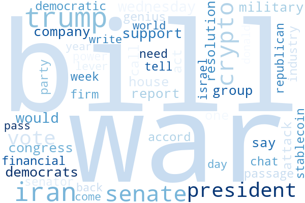

- __Тема 04 — «Студенты, границы, протесты»__

Ключевые слова: _student, states, border, protest, detention, free, deportation, fear, united_

Это тема о социальных правах, протестах, миграции и образовании. 
Упоминаются _student, protest, free, detention, deportation, border_ — возможно, речь идёт о студенческих инициативах, включая иммиграционную политику и антидепортационные движения.

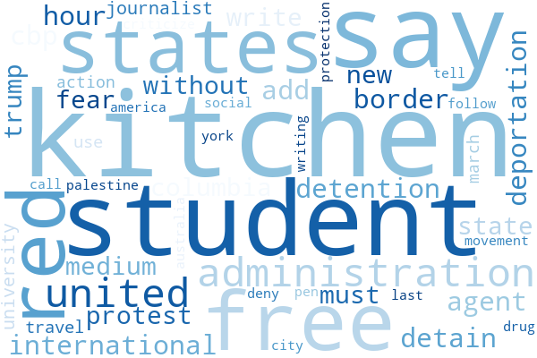

- __Тема 05 — «Антисемитизм, политика, полиция»__

Ключевые слова: _mamdani, antisemitism, candidate, jewish, muslim, police, state, law, lawmaker, speak_

Тема поднимает вопросы национальной и религиозной идентичности, гражданских прав, борьбы с антисемитизмом и исламофобией. Также, возможно, речь идет об ирано-израильском конфликте. 

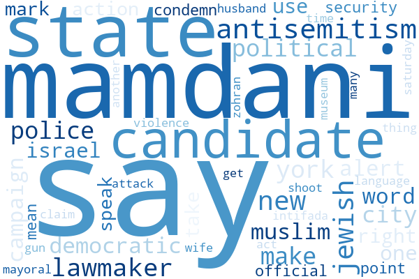

- __Тема 15 — «Социальная безопасность, льготы, ветераны»__

Ключевые слова: _social, security, benefit, veteran, healthcare, fund, accord, executive, resolution_

Тема подчёркивает важность социальной политики и социальной защиты Также заметны термины из политического контекста: trump, senate, law.

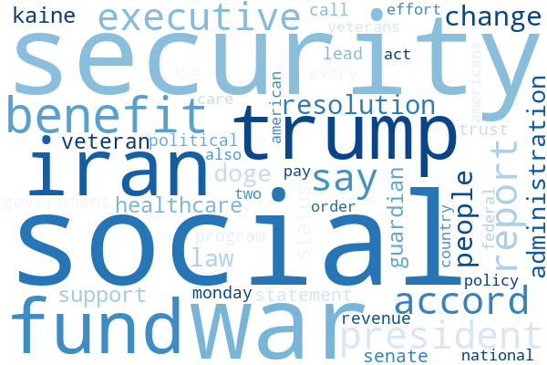

### Самые республиканские темы:

- __Тема 01 — «Новости, Хамас, Газа, патриотизм»__

Ключевые слова: _news, breitbart, hamas, gaza, attack, aid, terrorist, patriot, military, soliman, report, author, follow_

Эта тема касается военных конфликтов на Ближнем Востоке. 

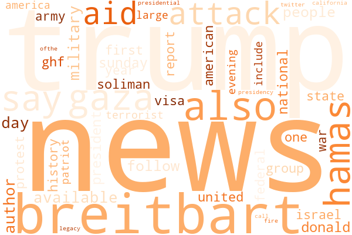

- __Тема 06 — «Россия, Украина, Трамп и медиа»__

Ключевые слова: _trump, say, make, news, russia, ukraine, attack, breitbart, medium, post, parade, military, child_

Эта тема касается конфликта России с Украиной.

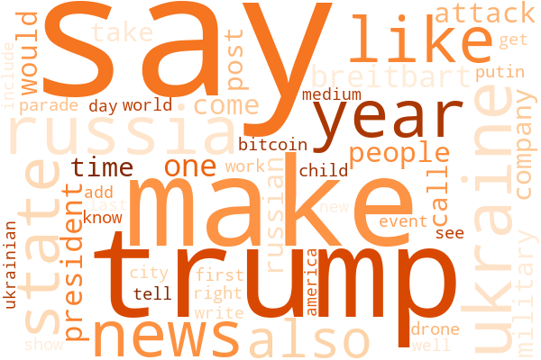

- __Тема 08 — «Трамп, президент, народ, политика»__

Ключевые слова: _trump, president, donald, say, people, know, make, one, state, biden, house, administration_

Эта тема сфокусирована на персоналиях и лидерстве - речь идет о фигуре Дональда Трампа. Часто встречаются обобщённые политические термины: president, state, people, know, say, что может указывать на риторику, связанную с высказываниями, заявлениями и медийной реакцией. Повторяются также фамилии biden и musk.

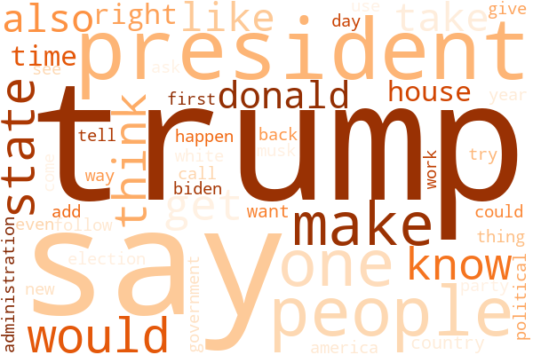

- __Тема 09 — «Иммиграция, ICE, закон и порядок»__

Ключевые слова: _ice, trump, law, enforcement, los angeles, illegal, arrest, criminal, immigrant, riot, federal, newsom, guard_

Тема явно связана с иммиграционной повесткой и безопасностью. Часто встречается los angeles - это связано с недавними беспорядками в городе. 

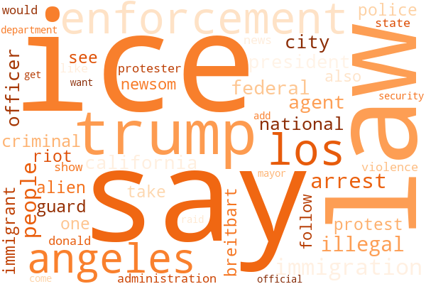

## Выводы
В ходе исследования были проанализированы тексты новостей из республиканских и демократических источников. Мы использовали различные методы: skipgrams, модели word2vec, кластеризацию, анализ тональности и тематическое моделирование.

Основные наблюдения:
- Лексическое окружение ключевых слов (_america, democracy, migrant_) часто совпадает между корпусами, но акценты немного различаются
- Word2Vec-модели показали, что одни и те же слова могут иметь разные ассоциации в зависимости от политической принадлежности источника. 
- Кластеризация выявила: республиканские тексты более чётко структурированы по темам (например, иммиграция, армия, порядок), а демократические — более разнообразны и разбросаны по социальным и гуманитарным темам (медицина, протесты, права мигрантов).
- Анализ тональности дал смешанные результаты: VADER и TextBlob находят чуть более позитивный тон у демократов, а нейросетевая модель RoBERTa — наоборот, более негативный.
- Тематическое моделирование (LDA) показало, что республиканские источники чаще говорят о Трампе, миграции, силовых структурах и конфликтах. Демократические — о социальных гарантиях, правах меньшинств, здравоохранении и о свободе слова.